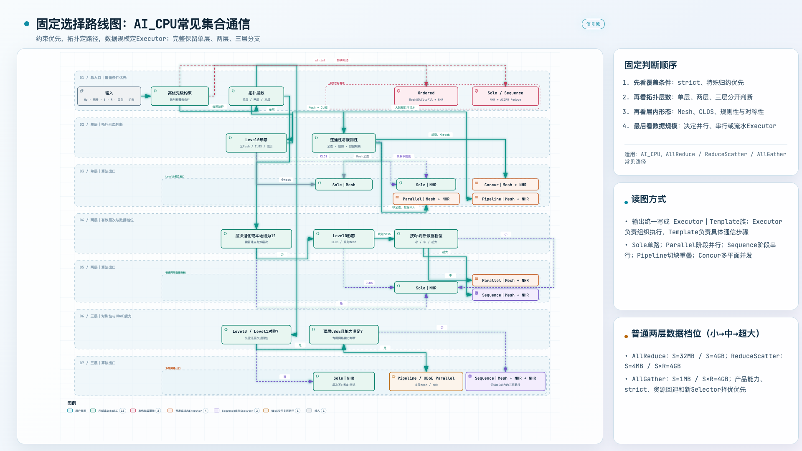
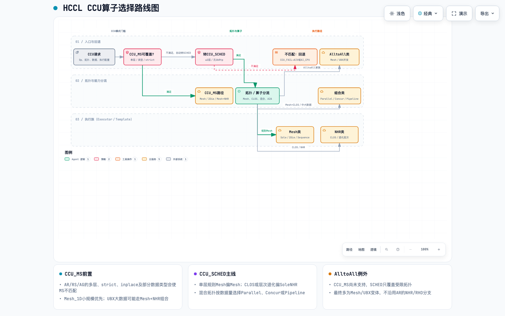
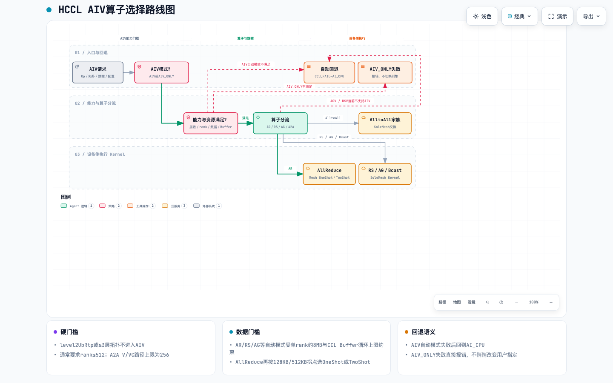

# HCCL Learning

本仓库整理HCCL在AI_CPU、CCU和AIV执行引擎下的常见集合通信算法选择资料，重点回答三个问题：

1. 给定算子、组网拓扑和数据规模，HCCL如何选择通信路径？
2. Algorithm、Executor和Template分别负责什么，三者如何衔接？
3. 面向方案估算和汇报时，应该用什么粒度描述算法选择？

> 本仓库是基于开源代码整理的学习与分析材料，不代表官方产品规格、性能承诺或完整Selector实现。

## 一页总览

### AI_CPU



### CCU与AIV

| CCU（`CCU_MS`/`CCU_SCHED`） | AIV |
| --- | --- |
|  |  |

核心判断顺序：

1. **先看执行配置和引擎能力**：`CCU_MS`不匹配后尝试`CCU_SCHED`；AIV自动模式不匹配后进入AI_CPU路径。
2. **再看硬约束**：`strict`、特殊归约、数据类型、rank、层数和Buffer能力优先于普通性能规则。
3. **再看拓扑形态**：Mesh、CLOS、连通性、规则性、对称性和UBoE能力决定可用算法族。
4. **最后看数据规模**：数据档位进一步决定Sole、Parallel、Sequence、Pipeline、Concur或OneShot/TwoShot等编排。
5. **Template负责落地执行细节**：算法、Executor和Template分层描述，不能混为同一组候选项。

## 仓库内容

| 分类 | 文件 | 用途 |
| --- | --- | --- |
| 系统分析 | [算法选择目录](docs/analysis/hccl-algorithm-selection-catalog.md) | 算法、Executor、Template和Selector的整体关系 |
| 触发规则 | [AI_CPU常见算法触发条件](docs/analysis/hccl-aicpu-common-algorithm-triggers.md) | 按常见集合通信场景梳理触发条件 |
| 汇报材料 | [领导汇报版](docs/briefing/hccl-algorithm-selection-leadership-brief.md) | 面向非实现人员解释决策方法和估算口径 |
| AI_CPU单页 | [AI_CPU一页PPT版说明](docs/briefing/hccl-aicpu-selector-one-slide.md) | 按拓扑层次和数据规模选择Executor |
| CCU单页 | [CCU算子选择说明](docs/briefing/hccl-ccu-selector-one-slide.md) | `CCU_MS`、`CCU_SCHED`、Mesh/NHR组合与回退关系 |
| AIV单页 | [AIV算子选择说明](docs/briefing/hccl-aiv-selector-one-slide.md) | AIV能力门控、固定Mesh Kernel及OneShot/TwoShot选择 |
| 图片 | [AI_CPU](assets/hccl-aicpu-selector-one-slide-archify-tree-1920x1080.png) · [CCU](assets/hccl-ccu-selector-one-slide.png) · [AIV](assets/hccl-aiv-selector-one-slide.png) | 汇报和README预览素材 |
| 交互图 | [AI_CPU](diagrams/hccl-aicpu-selector-one-slide-archify-tree.html) · [CCU](diagrams/hccl-ccu-selector-one-slide.html) · [AIV](diagrams/hccl-aiv-selector-one-slide.html) | 本地浏览完整路径、浅色／深色主题和导出功能 |
| 图表源文件 | [AI_CPU](diagrams/hccl-aicpu-selector-one-slide-archify-tree.workflow.json) · [CCU](diagrams/hccl-ccu-selector-one-slide.archify.json) · [AIV](diagrams/hccl-aiv-selector-one-slide.archify.json) | 后续修改、校验和重新生成 |

## 推荐阅读顺序

1. 先看AI_CPU一页总览，建立“约束→拓扑→数据规模→Executor”的主线。
2. 再看CCU与AIV两页，理解执行引擎门控、算法族和Template之间的关系。
3. 然后阅读领导汇报版和常见算法触发条件，掌握估算口径与典型出口。
4. 最后查算法选择目录，用于回到代码结构和细粒度实现。

## 分析范围

- 代码来源：[cann/hccl](https://gitcode.com/cann/hccl)
- 代码基线：提交`7696133a`
- 执行引擎：AI_CPU、CCU（`CCU_MS`/`CCU_SCHED`）、AIV
- 重点算子：AllReduce、ReduceScatter、AllGather、Broadcast和AlltoAll家族
- 重点内容：常见Selector路径、Executor组织方式与Template族

真实运行结果仍可能受到产品型号、通信域资源、数据类型、归约类型、确定性要求、Selector版本和运行时回退逻辑影响。

## 查看交互图

克隆仓库后，用浏览器打开任一交互图：

```text
diagrams/hccl-aicpu-selector-one-slide-archify-tree.html
diagrams/hccl-ccu-selector-one-slide.html
diagrams/hccl-aiv-selector-one-slide.html
```

交互图支持浅色／深色主题、路径聚焦、章节引导和图表导出。
