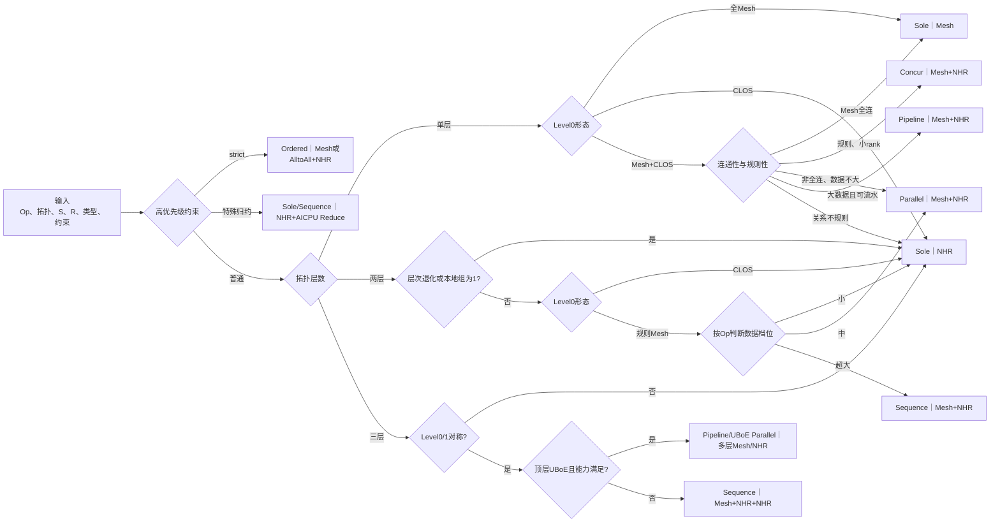

# HCCL AI_CPU通信方案选择：一页PPT版

## PPT标题

**HCCL先由约束和拓扑确定通信路径，再由数据规模决定Executor**

## 左侧主图（约70%宽度）

## 右侧图例（约30%宽度）

### 输入和判断字段

- `Op/S/R`：算子、单rank数据量和rank数；部分分支使用`S×R`。
- `全Mesh/CLOS`：本层全部rank直连/经交换网络通信。
- `特殊域`：归约类Op的64位或PROD进入多层、CLOS或非全Mesh通信域。
- `退化`：Level1Nhr、Level0Nhr或本地组为1，无法建立有效层次。
- `规则混合`：Mesh/CLOS分组关系稳定，可以并发利用两个通信平面。
- `UBoE`：顶层专用网络，能力满足时可进入专用并行或流水路径。

### 输出格式

`Executor｜Template族`

- `Sole`单路；`Parallel`阶段并行；`Sequence`阶段串行。
- `Pipeline`切块重叠；`Concur`多平面并发；`Ordered`确定性优先。

## 底部阈值条

| 普通两层组网 | 小→中 | 中→超大 |
| --- | --- | --- |
| AllReduce | `S=32MB` | `S=4GB` |
| ReduceScatter | `S=4MB` | `S×R=4GB` |
| AllGather | `S=1MB` | `S×R=4GB` |

PCIe混合且Mesh不全连时：AllReduce达到`32MB`、ReduceScatter/AllGather达到`4MB`后转Pipeline。

页脚：`适用范围：提交7696133a、AI_CPU、AllReduce/ReduceScatter/AllGather常见路径；特殊产品能力、strict、资源回退和新Selector成本择优优先。`

## 演讲备注（不放在PPT正文）

1. 图的输出不是一个“算法名”，而是`Executor｜Template族`组合。
2. strict、64位类型和PROD属于高优先级覆盖条件，先于普通拓扑性能规则。
3. 单层主要看Level0是全Mesh、CLOS还是混合拓扑。
4. 两层规则Mesh才进入小/中/超大数据分档：小数据压平为Sole NHR，中等数据并行Mesh+NHR，超大数据切Sequence。
5. 三层先看对称性；不对称回退NHR，对称后再看顶层UBoE能力。
6. Template细节只需在答疑时说明：小数据常用OneShot，大数据可能使用Chunk，多端口使用MultiLink。
