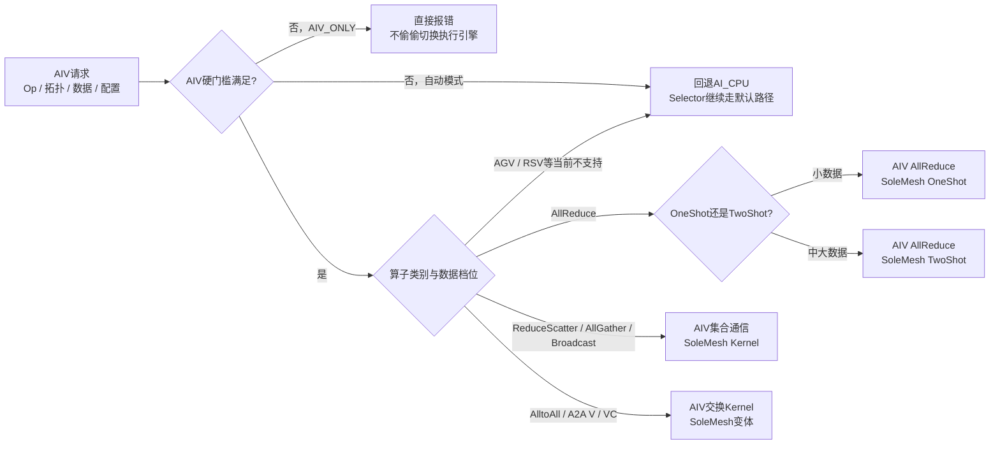
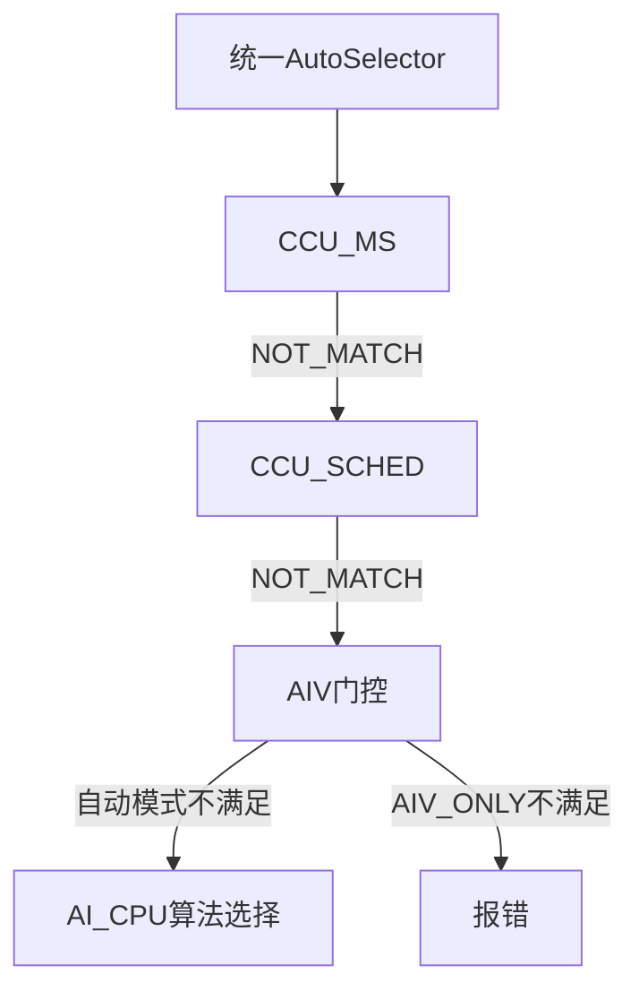

# HCCL AIV算子选择：一页PPT版

## PPT标题

**AIV先判设备侧能力和资源，再按算子类别选择固定Mesh Kernel；不满足时按模式决定回退还是报错**

## 1. 先把算法、执行器、模板分开

| 层次 | AIV中的含义 | 典型例子 |
| --- | --- | --- |
| 算法族 | 数据在设备侧如何组织通信关系 | 当前常见路径基本是SoleMesh，不是Ring/NHR族 |
| Executor | 把AIV Kernel接入HCCL调度、处理参数和同步 | `AivAllReduce...`、`AivAllGather...` |
| Template/Kernel | 真正执行搬运、归约、同步的设备侧模板 | AllReduce的OneShot/TwoShot，RS/AG的SoleMesh，AlltoAll的SoleMesh交换 |

因此“多数AIV都是Mesh”描述的是**AIV当前实现的Kernel族**，不是说所有HCCL算子都无条件选择Mesh；前面仍有严格的能力门控。

## 2. 固定选择路线图

## 3. AIV先判哪些前置条件

| 门控类别 | 代表性规则 | 结论 |
| --- | --- | --- |
| 拓扑能力 | `level2UbRtp`不支持；拓扑层数`≥3`通常不支持 | 直接退出AIV候选 |
| rank规模 | AR/RS/AG常见上限为`512`；AlltoAll V/VC常见上限为`256` | 超过上限回退或报错 |
| 模式/语义 | strict保序、部分PROD以及UINT64/FP64等类型不支持 | 退出AIV候选 |
| 资源 | 必须能够取得HCCL CCL Buffer | Buffer不可用则退出 |
| 数据总量 | 自动模式常受“单rank约`8MB`”和`Buffer×16`循环上限约束 | 太大时自动回退；AIV_ONLY报错 |
| 特殊回退 | ATU等特殊资源条件会触发AIV回退判断 | 交给下一执行引擎 |

## 4. 通过门控后，算子如何分流

| 算子 | 典型AIV Kernel | 什么时候触发细分 |
| --- | --- | --- |
| AllReduce | `AivAllReduceSoleMeshOneShot`或`TwoShot` | rank≤8时约`128KB`为常见拐点；更大rank约`512KB`附近切换，实际以源码常量为准 |
| ReduceScatter | `AivReduceScatterSoleMesh` | 通过拓扑、rank、Buffer和总数据量门槛后基本固定为SoleMesh |
| AllGather | `AivAllGatherSoleMesh` | 通过总数据量、UBX特殊大数据和Buffer门槛后固定为SoleMesh |
| Broadcast | AIV对应SoleMesh路径 | 重点看能力门槛，不再细分Ring/NHR |
| AlltoAll | `AivAllToAllSoleMesh` | 自动模式还要满足约`8MB/rank`与`Buffer×16`限制 |
| AlltoAllV/VC | `AivAllToAllVSoleMesh`/`VCSoleMesh` | 常见rank上限为`256`，并检查拓扑层数和`level2UbRtp` |
| AllGatherV/ReduceScatterV | 当前AIV Selector不承接 | 直接回到AI_CPU等后续路径 |

## 5. OneShot、TwoShot和Mesh的关系

- `Mesh`是AIV的通信关系/Kernel族。
- `OneShot`和`TwoShot`是同一Mesh族下的执行模板差异，主要由单次启动开销、数据规模和rank规模决定。
- 因此不能把“OneShot/TwoShot”与“Mesh/NHR”放在同一层比较：前者更细，后者更粗。

## 6. AIV与CCU/AI_CPU的衔接

这里的“回退”是执行引擎切换，不是把AIV算法改名成AI_CPU算法。AIV Selector中多个常见实现显式忽略`configAlgMap`，重点是判断设备侧Kernel是否可用；具体算法族和阈值由算子Selector内部固定规则决定。

## 7. 给领导汇报时的一句话

> **AIV的决策重点不是在Ring和NHR之间做复杂拓扑择优，而是先确认设备侧Kernel的拓扑、rank、数据和Buffer能力是否覆盖；覆盖后多数算子落到固定Mesh Kernel，AllReduce再按数据规模在OneShot/TwoShot之间切换，不覆盖时自动模式回AI_CPU，AIV_ONLY则明确报错。**

## 源码定位

- [统一AutoSelector与AIV回退语义](https://gitcode.com/cann/hccl/blob/7696133a450094fe26dd1eaed7b075258b452a9f/src/ops/op_common/selector/auto_selector_base.cc)
- [AIV公共阈值与循环上限](https://gitcode.com/cann/hccl/blob/7696133a450094fe26dd1eaed7b075258b452a9f/src/ops/op_common/selector/auto_selector_base.h)
- [AllReduce AIV选择](https://gitcode.com/cann/hccl/blob/7696133a450094fe26dd1eaed7b075258b452a9f/src/ops/all_reduce/selector/all_reduce_auto_selector.cc)
- [ReduceScatter AIV选择](https://gitcode.com/cann/hccl/blob/7696133a450094fe26dd1eaed7b075258b452a9f/src/ops/reduce_scatter/selector/reduce_scatter_auto_selector.cc)
- [AllGather AIV选择](https://gitcode.com/cann/hccl/blob/7696133a450094fe26dd1eaed7b075258b452a9f/src/ops/all_gather/selector/all_gather_auto_selector.cc)
- [AlltoAll AIV选择](https://gitcode.com/cann/hccl/blob/7696133a450094fe26dd1eaed7b075258b452a9f/src/ops/all_to_all_v/selector/alltoall_auto_selector.cc)

配套交互图：[AIV单页路线图（HTML）](../../diagrams/hccl-aiv-selector-one-slide.html)，规格文件：[Archify JSON](../../diagrams/hccl-aiv-selector-one-slide.archify.json)。
