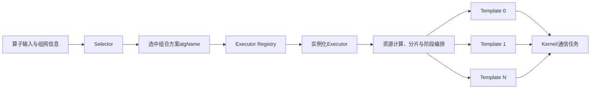
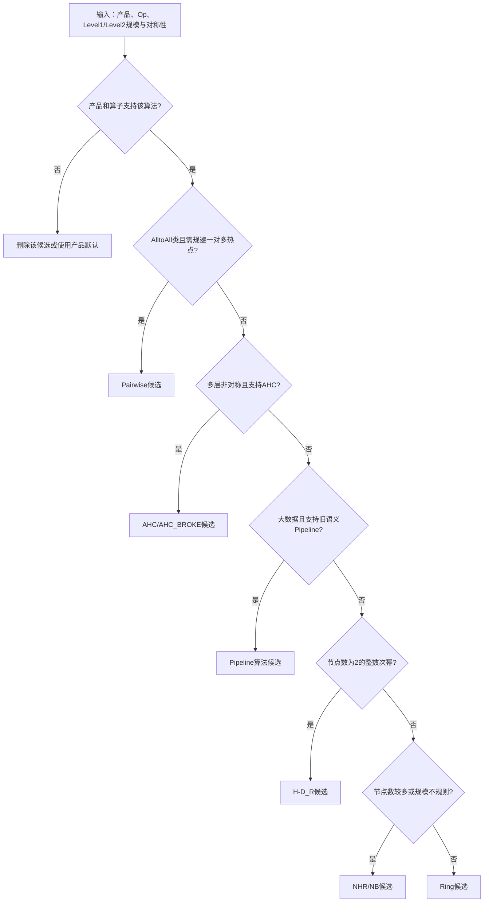
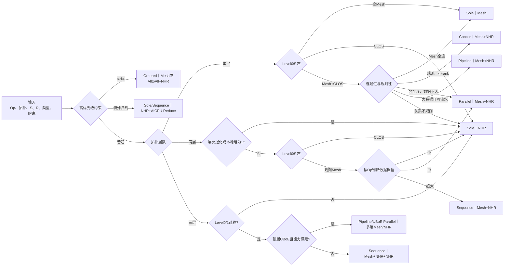

# HCCL通信方案选择：Algorithm、Executor与Template分层说明

## 1. 文档目的与结论

本文面向需要做方案评审和性能估算、但不参与HCCL具体编码的管理者和技术负责人，回答三个问题：

1. HCCL中的通信算法、Executor和Template分别是什么，三者是什么关系。
2. 给定一种组网、算子和数据规模，怎样沿固定路线判断候选方案。
3. 确定候选方案后，应该采用什么方法估算性能。

先给出结论：

- `Parallel`、`Sequence`、`Pipeline`、`Concur`和`Sole`主要描述**Executor编排方式**，不应与`Mesh`、`NHR`、`Ring`、`H-D_R`等通信算法放在同一个层次比较。
- 实际选择不是只由拓扑决定。拓扑决定候选通信路径，算子和数据规模决定编排收益，执行引擎、数据类型、确定性和资源条件负责淘汰不可用方案。
- 从设计逻辑上可以按“通信路径→Executor→Template变体”理解；但当前源码通常直接选中一个已经绑定三者的**组合方案名**，并不是运行三个完全独立的Selector。
- 对固定版本、固定产品和AI_CPU场景，可以形成相对固定的选择路线图；跨产品或版本时，只能把它作为候选生成框架，不能把阈值当成永久接口。
- 性能估算应以“**组合方案的分阶段成本模型+目标环境标定**”为主，而不是只估算某个Mesh或NHR算法的理论带宽。

本文基于`master`分支提交`7696133a`，主要覆盖AllReduce、ReduceScatter、AllGather在AI_CPU路径上的常见选择。

## 2. 先统一术语：四个不同层次

### 2.1 分层定义

| 层次 | 解决的问题 | 当前源码中的典型对象 | 典型名称 |
| --- | --- | --- | --- |
| 执行引擎Engine | 由哪类计算/调度资源展开通信 | `OpExecuteConfig` | AICPU、AIV、CCU_MS、CCU_SCHED、DPU |
| 通信算法Algorithm | 一个通信域内，数据按照什么逻辑路径交换 | 公开`HcclAlgoType`或内部算法族 | Ring、H-D_R、NHR、NB、AHC、Pairwise、Mesh |
| 编排器Executor | 多个拓扑层、通信阶段和数据分片如何组织 | `Ins*Executor` | Sole、Parallel、Sequence、Pipeline、Concur、StrictOrdered |
| 实现模板Template | 某个阶段具体怎样切片、收发、归约和同步 | `InsTemp*`、`AivTemp*`、`CcuTemp*` | Mesh1D、NHR、OneShot、TwoShot、Chunk、MultiLink |

需要特别注意两类命名问题：

1. 在新内部配置模型中，源码把`mesh`、`nhr`及其变体放在`ALGO_TYPES`中，但这些类型最终对应的是Executor绑定的Template族。本文为了保持职责清晰，将它们称为“通信算法族/Template族”。
2. `Pipeline`在旧版公开`HCCL_ALGO`枚举中也出现过，但在当前组合名称和新配置语法中，`pipeline{...}`明确处于Executor维度。本文除非专门讨论旧环境变量语义，否则`Pipeline`均指Executor。

### 2.2 三层不是同义词

以`AicpuAllReduceParallelMeshNHR`为例：

| 名称片段 | 含义 |
| --- | --- |
| `Aicpu` | 执行引擎 |
| `AllReduce` | 集合通信算子 |
| `Parallel` | Executor采用并行编排 |
| `MeshNHR` | 方案同时使用Mesh和NHR通信阶段 |

该名称在注册时实际绑定：

- Executor类：`InsAllReduceParallelExecutor`。
- 拓扑匹配器：`TopoMatchMultilevel`。
- ReduceScatter阶段Template：`InsTempReduceScatterMesh1D`、`InsTempReduceScatterNHR`。
- AllGather阶段Template：`InsTempAllGatherMesh1D`、`InsTempAllGatherNHR`。

也就是说，一个表面上的“算法名”实际上是一个可执行方案标识，内部包含Engine、Op、Executor、拓扑匹配规则和一组Template。

### 2.3 逻辑分层与源码实际流程



因此，“先选算法、再选Executor、最后选Template”适合用于方案分析，但不能理解成当前代码中存在三个串行、彼此独立的选择函数。旧Selector多由`if/else`直接返回组合方案；新Selector则对已注册的组合方案进行属性过滤和成本比较。

## 3. 一个组网能否直接决定算法

不能只给一张拓扑图就唯一确定最终方案。最少还需要下面这些输入：

| 输入类别 | 必要字段 | 作用 |
| --- | --- | --- |
| 算子 | AllReduce、ReduceScatter、AllGather等 | 决定通信阶段、流量和Template集合 |
| 拓扑层次 | `topoLevelNums` | 判断单层、两层还是三层编排 |
| Level0形态 | `MESH_1D`、`CLOS`、`MESH_1D_CLOS` | 判断本地直连、交换网络或混合网络 |
| 连通性 | Mesh能否覆盖全部rank | 决定能否只用Mesh，还是必须引入NHR |
| 规则性 | 分组是否对称、是否退化、Mesh/CLOS组数关系 | 决定能否并行、Concur或Pipeline |
| 链路属性 | PCIe混合、UBX、顶层UBoE、端口数 | 决定特殊编排和有效带宽 |
| 规模 | 单rank数据量`S`、rank数`R`、`S×R` | 决定Sole、Parallel、Sequence或Pipeline |
| 强约束 | 数据类型、归约类型、strict确定性、in-place、对称内存 | 可能覆盖普通性能路径 |
| 资源 | CCL Buffer、执行引擎和通道资源 | 决定能否执行及是否回退 |

所以，比较准确的表达是：

```text
拓扑生成通信路径候选；
算子和数据规模选择编排方式；
能力、确定性和资源条件执行否决；
成本模型或固定规则在剩余组合中确定最终方案。
```

### 3.1 如果讨论的是公开通信算法，先走这条路线

Ring、H-D_R、NHR、NB、AHC和Pairwise主要回答Level1/Level2通信域采用哪种数据交换模式。下面给出的是人工配置或方案评审时的粗粒度候选路线，不代表跳过产品支持检查：



该路线解决的是“通信算法族候选”问题。选出H-D_R、NHR等方向以后，仍然要由具体产品路径决定采用哪个Executor和Template。对于本文重点分析的当前AI_CPU组合方案，主干Template是Mesh/NHR及其变体，Ring、H-D_R、NB和AHC不会直接替代Parallel、Sequence等Executor名称。

## 4. 固定选择路线图：AI_CPU常见集合通信

下面是适合放入一页PPT的压缩版路线图，适用于当前提交中AllReduce、ReduceScatter、AllGather的常见AI_CPU路径。

图中所有结果统一写成`Executor｜Template族`。例如`Parallel｜Mesh+NHR`表示：外层由Parallel Executor编排，Level0/Level1阶段分别使用Mesh和NHR类Template。



### 4.1 图中每一项的具体含义

| 图中项目 | 具体含义 | 对选择的影响 |
| --- | --- | --- |
| `Op` | AllReduce、ReduceScatter或AllGather | 不同Op的数据量阈值和内部通信阶段不同 |
| `S` | 单rank输入数据量，`count×sizeof(dataType)` | 小数据重时延，大数据重带宽和资源 |
| `R` | 通信域rank总数 | 影响通信轮次、全局规模和大rank特殊规则 |
| 高优先级约束 | strict确定性、64位类型、PROD及执行引擎能力 | 一旦命中，直接覆盖普通拓扑性能路径 |
| 特殊归约 | INT64、UINT64、FP64或PROD进入多层、CLOS或非全Mesh通信域 | 普通归约Template被NHR+AICPU Reduce路径替代 |
| 拓扑层数 | 单层、两层或三层通信域 | 决定是否需要跨层Executor |
| Level0 | 最底层、通常也是节点内或模块内的通信平面 | 全Mesh优先Mesh Template，CLOS倾向NHR |
| 全Mesh | Mesh链路能够覆盖当前层全部rank | 可以使用`Sole｜Mesh`，无需跨CLOS补路 |
| Mesh+CLOS | 同一层同时存在直连Mesh和交换型CLOS链路 | 需要继续判断是否全连、规则、PCIe混合及能否并发 |
| 退化 | `Level1Nhr/Level0Nhr=true`、本地组大小为1等 | 有效层次无法建立，通常压平为`Sole｜NHR` |
| 不对称 | 同层不同通信组的规模或结构不一致 | Parallel、Concur、Pipeline等规则编排可能不成立 |
| 数据档位 | 根据Op分别判断小、中、超大数据 | 决定Sole、Parallel还是Sequence/Pipeline |
| UBoE能力 | 顶层使用UBoE且对称性、模块规模等条件满足 | 进入专用Pipeline或UBoE Parallel路径 |
| `Executor｜Template` | 左侧是阶段编排，右侧是通信实现族 | 这是图的最终输出格式，不是一个单独算法名 |

图的阅读顺序可以压缩成三句话：

1. **先看强约束**：strict和特殊归约优先，普通性能规则不再参与。
2. **再看拓扑**：全Mesh选Mesh，CLOS/退化选NHR，规则多层或混合链路保留Mesh+NHR组合。
3. **最后看数据规模**：小数据减少编排，中等数据尝试并行，大数据再考虑Sequence或Pipeline。

### 4.2 一页PPT右侧图例

主图旁边只保留下面两组信息即可。

**Executor解释**

| 名称 | PPT中的一句话解释 |
| --- | --- |
| Sole | 单一路径完成，启动和同步开销最低 |
| Parallel | 多个通信阶段并行，总时间由慢的一路主导 |
| Sequence | 多个通信阶段串行执行，适合超大数据或资源受限 |
| Pipeline | 数据切块后跨阶段重叠，适合大数据 |
| Concur | 在规则混合拓扑上并发使用Mesh和CLOS |
| Ordered | 固定归约顺序，确定性优先于性能 |

**数据阈值速记**

| 场景 | 小→中分界 | 中→超大分界 |
| --- | --- | --- |
| 两层AllReduce | `S=32MB` | `S=4GB` |
| 两层ReduceScatter | `S=4MB` | `S×R=4GB` |
| 两层AllGather | `S=1MB` | `S×R=4GB` |
| PCIe混合流水 | AR：`32MB`；RS/AG：`4MB` | 达到后转Pipeline |

Template变体不进入主图，在页脚写成一行即可：`小数据→OneShot；中等数据→TwoShot；大数据→Chunk；多链路→MultiLink`。

推荐的16:9排版比例是：左侧主流程图约占70%，右侧Executor解释和阈值约占30%，底部用一行说明适用范围。PPT标题建议使用结论式表达：**HCCL先由约束和拓扑确定通信路径，再由数据规模决定Executor**。

可以直接复制到单页材料的精简内容见[HCCL AI_CPU通信方案选择：一页PPT版](hccl-aicpu-selector-one-slide.md)。

## 5. 各层具体怎样判别

### 5.1 第一步：先做硬约束过滤

硬约束优先级高于普通拓扑和性能规则：

| 条件 | 典型结果 | 原因 |
| --- | --- | --- |
| AllReduce/ReduceScatter开启strict确定性 | StrictOrdered或OrderPreserved Executor | 必须固定浮点归约顺序 |
| INT64、UINT64、FP64或PROD跨多层/非全连接域 | NHR+AICPU Reduce类Template | 普通归约Template的类型或算子能力不满足 |
| 执行引擎不支持当前拓扑、类型或in-place | 尝试其他引擎，最终可回退AI_CPU | Engine能力先于普通性能选择 |
| Buffer、通道或ATU资源不足 | 切换Template、Executor或执行引擎 | 已选方案必须能够分配运行资源 |
| 三层、UBoE、PCIe混合等特殊网络 | 进入专用分支 | 通用单层规则不能覆盖链路差异 |

### 5.2 第二步：按拓扑确定通信算法族候选

| 组网特征 | 优先保留的算法/Template族 | 通常淘汰的方向 |
| --- | --- | --- |
| 单层且Mesh覆盖全部rank | Mesh | 无必要使用跨层NHR |
| 单层纯CLOS | NHR，存在多端口时考虑MultiLink | 假设全直连的Mesh |
| Level1退化，分组最大公约数为1 | 扁平NHR | 依赖有效层次划分的Mesh+NHR |
| 两层、Level0规则Mesh、Level1可组织 | Mesh+NHR组合 | 纯单层Mesh |
| 三层且各层对称 | Mesh+NHR+NHR组合 | 只覆盖两层的Executor |
| 拓扑不对称或本地组大小为1 | Sole NHR兜底 | 对对称分组有要求的并行/流水 |
| Mesh+CLOS混合且关系规则 | Mesh和NHR组合 | 只使用一个平面而浪费另一类链路 |
| 旧版`HCCL_ALGO`显式指定Ring/H-D_R/NB/AHC | 进入相应的旧算法配置/校验路径 | 不能直接映射为当前AI_CPU的Executor名称 |

最后一行只表示旧版或公开配置语义。当前AI_CPU组合方案的主干是Mesh/NHR及其变体，不应把Ring、H-D_R直接塞进上面的Executor分支图。

### 5.3 第三步：选择Executor

| Executor | 选择前提 | 适用原因 | 不适合的情况 |
| --- | --- | --- | --- |
| Sole | 单个有效通信平面，或小数据不值得拆层 | 启动、同步和资源开销最低 | 大数据且多层链路可以并行 |
| Parallel | 至少两个阶段或通信平面能够同时推进 | 总时间接近最慢阶段，而不是阶段之和 | 两阶段强依赖、资源不足或数据太小 |
| Sequence | 阶段存在前后依赖，或超大数据需要控制资源 | 行为稳定，易控制内存和通道 | 可充分重叠且资源充足时可能较慢 |
| Pipeline | 数据可切块，不同层链路能形成稳定流水 | 大数据时覆盖部分阶段时间 | 小数据、切块太少、填充排空开销过高 |
| Concur | Mesh和CLOS关系规则，rank较少且多个平面可并发 | 同时使用多类链路 | 非对称、rank较大或拓扑关系不规则 |
| StrictOrdered/OrderPreserved | 业务要求确定性 | 保证归约次序 | 不要求确定性时通常不是性能首选 |

### 5.4 第四步：选择Template变体

Template属于实现细节，但估算时仍需知道它改变了什么：

| Template变体 | 主要变化 | 常见选择条件 |
| --- | --- | --- |
| Mesh1D | 在规则直连平面执行通信 | 单层全Mesh或多层的Level0阶段 |
| NHR | 在CLOS、跨层或不规则域通信 | Level1/Level2、拓扑退化或扁平兜底 |
| OneShot | 用较少阶段完成小数据通信 | 小数据，目标是降低固定时延 |
| TwoShot | 将归约和分发拆成更合适的阶段 | 中等及更大数据，平衡带宽与同步 |
| Chunk | 对大数据分块循环 | 单次数据过大或Buffer压力较高 |
| MultiLink/MultiJetty | 利用多个端口或多条链路 | CLOS或规则多链路场景 |
| AicpuReduce | 由AI_CPU承担特殊归约 | 64位类型或PROD等特殊场景 |

Template不是再次进行全局拓扑选择。它是Executor已经确定通信阶段后，对每个阶段的具体实现。

## 6. 两层规则组网的数据量分支

以下表格描述当前AI_CPU旧Selector的普通两层Mesh场景。前提是已经通过硬约束检查，不存在Level1退化、特殊类型、UBoE和PCIe混合等更高优先级分支。

定义：

- `S`：单rank数据量，通常为`count×sizeof(dataType)`。
- `R`：通信域rank数。
- `G=S×R`：当前规则使用的全局数据规模指标。

| 算子 | 小数据：Sole+NHR | 中等数据：Parallel+Mesh/NHR | 超大数据：Sequence+Mesh/NHR |
| --- | --- | --- | --- |
| AllReduce | `S≤32MB` | `32MB<S≤4GB` | `S>4GB` |
| ReduceScatter | `S≤4MB` | `S>4MB`且`G≤4GB` | `G>4GB` |
| AllGather | `S≤1MB` | `S>1MB`且`G≤4GB` | `G>4GB` |

还有两条大rank优先规则：

- ReduceScatter在`R≥256`且`G≥1GB`时优先Parallel。
- AllGather在`R≥1024`且`G≥1GB`时优先Parallel。

这些阈值解释了为什么同样的两层Mesh组网，只改变算子或数据量，最终Executor也会变化。

## 7. 单层混合组网的关键分支

### 7.1 PCIe混合组网

前提是`MESH_1D_CLOS`且`level0PcieMix=true`：

| 判断 | AllReduce | ReduceScatter | AllGather |
| --- | --- | --- | --- |
| Mesh能够覆盖全部rank | Sole+Mesh | Sole+Mesh | Sole+Mesh |
| Mesh不能全连，未达到流水阈值 | Parallel+Mesh/NHR | Parallel+Mesh/NHR | Parallel+Mesh/NHR |
| Mesh不能全连，达到流水阈值 | Pipeline+Mesh/NHR | Pipeline+Mesh/NHR | Pipeline+Mesh/NHR |
| 流水阈值 | `32MB` | `4MB` | `4MB` |

这里先由连通性判断“是否必须跨PCIe”，再由数据量判断Parallel和Pipeline，顺序不能颠倒。

### 7.2 UBX规则组网

当`MESH_1D_CLOS`且不是PCIe混合时，Selector继续检查Mesh组与CLOS组之间的关系：

- 组数相等、rank较少：小数据使用`Sole+Mesh`，数据增大后可使用`Concur+Mesh/NHR`。
- CLOS组数是Mesh组数的整数倍：数据足够时进入`Parallel`或`Pipeline`候选。
- 支持对称内存等流水能力时倾向Pipeline；否则保留Parallel方案。
- 关系不规则或条件不完整时，回退`Sole+NHR`。

这说明“同样叫Mesh+CLOS”仍不足以确定方案，还必须知道分组比例、rank数和能力条件。

## 8. 三层组网的关键分支

三层组网首先检查Level0和Level1是否对称：

| 条件 | 典型组合 | 判断依据 |
| --- | --- | --- |
| 任一层不对称 | Sole+NHR | 规则多层编排不能成立，优先保证可执行性 |
| 两层均对称、顶层非UBoE | Sequence+Mesh/NHR/NHR | 按层顺序完成通信 |
| 两层均对称、顶层UBoE、每模块8卡 | Pipeline+多层Template | 满足当前专用流水分支 |
| 两层均对称、顶层UBoE、其他受支持形态 | UBoE Parallel+多层Template | 使用专用跨层并行方案 |

这里的Pipeline或Parallel是Executor；NHR/NHR表示Level1和Level2分别使用NHR类Template。

## 9. 三个完整判例

### 9.1 判例一：单机8卡全Mesh，AllReduce小数据

输入：

- 单层`MESH_1D`，Mesh覆盖全部8个rank。
- AllReduce，普通数据类型，无strict要求。
- 单rank数据量较小。

判断：

1. 硬约束全部通过。
2. 单层全Mesh，只需要Mesh通信算法族。
3. 没有跨层阶段，选择Sole Executor。
4. 小数据优先OneShot Template，减少固定启动开销。

结果可以表示为：`AICPU + AllReduce + Sole + MeshOneShot`。

### 9.2 判例二：每机8卡、16台服务器，两层规则Mesh，AllReduce 256MB

输入：

- Level0为规则Mesh，Level1为跨服务器通信域。
- 分组对称、未退化，`Level1Nhr=false`。
- AllReduce，单rank数据量`256MB`。

判断：

1. 拓扑允许Level0 Mesh和Level1 NHR组合。
2. `256MB`大于AllReduce的`32MB`拆层阈值，小于`4GB`Sequence阈值。
3. 选择Parallel Executor，同时推进机内和机间相关阶段。
4. AllReduce内部由ReduceScatter和AllGather阶段组成，各自绑定Mesh/NHR Template。

结果对应`AicpuAllReduceParallelMeshNHR`这一类组合方案。

### 9.3 判例三：单层Mesh+CLOS，PCIe混合且Mesh不能全连，AllGather 16MB

输入：

- `MESH_1D_CLOS`，`level0PcieMix=true`。
- Mesh不能覆盖全部rank，必须跨PCIe/CLOS路径。
- AllGather，单rank数据量`16MB`。

判断：

1. Sole Mesh被连通性条件淘汰。
2. 候选通信路径必须同时包含Mesh和NHR类阶段。
3. `16MB`达到AllGather的`4MB`流水阈值。
4. 选择Pipeline Executor，Template负责分块和两类链路的阶段执行。

结果对应`AicpuAllGatherPipeLinePcie`这一类组合方案。

## 10. 固定路线图能固定到什么程度

### 10.1 默认旧Selector

`HCCL_USE_NEW_SELECTOR=0`时，当前默认路径按源码中的优先级和阈值匹配。对固定提交、固定产品和明确输入，路线图可以得到相对确定的组合方案。

实际顺序不是单纯的“拓扑→数据量”，而是：

```text
执行引擎能力
→ strict/特殊类型等高优先级规则
→ 特殊链路与拓扑退化
→ 拓扑层数和对称性
→ 算子数据阈值
→ 返回组合algName
→ Registry实例化绑定Template的Executor
```

### 10.2 新Selector

`HCCL_USE_NEW_SELECTOR=1`时，当前仅AllReduce、ReduceScatter、AllGather进入新流程：

```text
收集已注册组合方案
→ 按执行引擎过滤
→ 按HCCL_ALGO配置过滤
→ 按拓扑和算子属性过滤
→ 计算每个组合方案cost
→ 可选Tuner修正
→ 选择最小cost
```

此时路线图仍然负责生成和过滤候选，但数据阈值不再完整决定最终结果，最终选择由成本比较完成。

### 10.3 为什么不能形成跨版本永久规则

- 产品支持的Engine、Executor和Template集合不同。
- 新增Template后，原来的最优组合可能变化。
- 拓扑匹配属性、阈值和成本参数都属于实现参数。
- `HCCL_ALGO`旧语法与新组合过滤语法存在版本差异。
- 资源回退可能改变最终执行引擎和组合方案。

因此，固定路线图适合做设计评审和排障，不应替代实际版本的Selector日志和目标机验证。

## 11. 性能估算应以“组合方案”为对象

### 11.1 不要只估算Mesh或NHR

只知道通信算法族还不足以估算时间。相同的Mesh+NHR，可以由Parallel、Sequence或Pipeline组织，三者的聚合方式完全不同：

| Executor | 估算聚合方式 | 主要风险 |
| --- | --- | --- |
| Sole | 单一路径的通信、本地处理和固定时延 | 小数据固定时延占比高 |
| Sequence | 各阶段时间求和 | 跨层阶段无法隐藏 |
| Parallel/Concur | 同一并行组取最大值，不同组求和 | 最慢阶段决定整体时间 |
| Pipeline | 首块填充+稳态瓶颈×后续块数+排空 | 切块过少时流水收益不足 |
| Ordered | 按固定次序估算，额外考虑分组和同步 | 为确定性牺牲并行度 |

### 11.2 Template阶段成本

当前成本模型对每个Template片段使用：

```text
Ti = (Ai / Ui + Bi) × S + Ci
```

| 参数 | 含义 |
| --- | --- |
| `S` | 单rank数据量 |
| `A` | 跨卡通信量和链路带宽形成的斜率 |
| `U` | 当前拓扑、引擎和数据档位下的有效带宽利用率 |
| `B` | 本地拷贝或本地归约形成的斜率 |
| `C` | 通信、同步等固定时延 |
| `D` | 源码成本参数中的任务下发开销 |

当前源码将串行组相加、并行组取最大值，并用`max(通信与本地处理成本, ΣD)`处理任务下发时间下界。

对于Pipeline，可在项目估算表中使用下面的近似式，再用实测校准：

```text
Tpipeline ≈ Tfill + (Nchunk - 1) × max(Tstage1, Tstage2, ...) + Tdrain
```

### 11.3 推荐估算流程


这是本文推荐的方法。原因是它同时保留了拓扑可解释性、Executor串并行关系和目标环境的真实效率。

### 11.4 估算方法决策记录

| 项目 | 决策 |
| --- | --- |
| 采用方案 | 组合候选+Template分阶段模型+目标机标定 |
| 不采用方案一 | 只用输入数据量除以理论峰值带宽；只能得到过度乐观的下界 |
| 不采用方案二 | 只按算法名套固定系数；无法区分Parallel、Sequence和Pipeline |
| 不采用方案三 | 前期穷举所有组合实测；成本过高且缺乏外推能力 |
| 主要代价 | 需要维护按产品、拓扑、算子和数据档位组织的标定数据 |
| 控制措施 | 版本绑定、阈值两侧采样、空闲/并发双场景测试、记录实际algName |

## 12. 建议的估算工作表

| 字段 | 示例 | 用途 |
| --- | --- | --- |
| 产品与版本 | NPU型号、CANN/HCCL版本 | 绑定能力和规则版本 |
| 算子与类型 | AllReduce、FP16/SUM | 决定阶段和归约能力 |
| 组网层次 | 8卡/机×16机、两层 | 计算每层rank和流量 |
| Level0形态 | MESH_1D | 生成Mesh候选 |
| 退化与对称性 | Level1Nhr=false、对称 | 判断能否分层并行 |
| 链路特征 | 非PCIe混合、顶层非UBoE | 排除特殊Executor |
| `S`、`R`、`S×R` | 256MB、128、32GB | 选择数据档位 |
| 硬约束 | 非strict、非in-place | 确认普通性能路径 |
| 组合候选 | SoleNHR、ParallelMeshNHR | 比较完整方案而非单一算法 |
| Template阶段 | RS-Mesh、RS-NHR、AG-Mesh、AG-NHR | 建立分阶段成本 |
| 聚合方式 | Parallel组内MAX | 正确处理重叠关系 |
| 标定参数 | 有效带宽、利用率、固定时延 | 修正理论模型 |
| 输出 | 预测值、P50、P90、偏差 | 形成可解释的承诺区间 |

向管理层汇报时，建议只呈现：最终组合方案、为什么通过路线图选中、主要瓶颈、预测区间、实测P50/P90以及风险条件。Template全名可以放在附录，不需要在主汇报页展开。

## 13. 使用路线图时的风险

| 风险 | 影响 | 处理方式 |
| --- | --- | --- |
| 把Executor当成通信算法 | 无法解释同一Mesh/NHR组合为什么性能不同 | 始终使用“Executor+Template族”描述结果 |
| 只看拓扑，不看算子和数据量 | 同一组网会得到错误的固定结论 | 输入必须包含Op、`S`和`R` |
| 忽略高优先级特殊分支 | strict、64位或PROD场景判断错误 | 先做硬约束过滤，再走普通路线 |
| 阈值附近线性外推 | 路径切换导致性能不连续 | 阈值两侧分别实测 |
| 使用理论峰值带宽 | 小数据和并发场景估算过于乐观 | 使用按数据档位标定的有效带宽 |
| 新旧Selector混用 | 对固定规则和成本择优产生错误预期 | 报告中明确`HCCL_USE_NEW_SELECTOR`状态 |
| 只记录预期方案 | 资源回退后实际Engine或algName可能变化 | 从运行日志回读最终选择 |

## 14. 源码对应关系

- `src/ops/op_common/selector/execute_selector.cc`：按算子和Selector优先级执行旧选择流程。
- `src/ops/op_common/selector/auto_selector_base.cc`：执行引擎尝试和回退顺序。
- `src/ops/all_reduce/selector/all_reduce_auto_selector.cc`：AllReduce的AI_CPU固定规则。
- `src/ops/reduce_scatter/selector/reduce_scatter_auto_selector.cc`：ReduceScatter的AI_CPU固定规则。
- `src/ops/all_gather/selector/all_gather_auto_selector.cc`：AllGather的AI_CPU固定规则。
- `src/ops/op_common/selector/hccl_algo_dims.h`：Engine、Executor、Template三个维度的枚举。
- `src/common/alg_parse.h`、`src/common/alg_parse.cc`：新`HCCL_ALGO`组合语法和Executor/Template过滤逻辑。
- `src/ops/op_common/executor/registry/coll_alg_v2_exec_registry.h`：组合方案与Executor、Template的注册绑定关系。
- `src/ops/op_common/selector/cost_model.h`、`cost_table.cc`：分阶段成本和SUM/MAX聚合方式。
- `src/ops/op_common/selector/selector_engine.cc`：新Selector的候选过滤、Tuner和最小成本选择。

更细的固定阈值和算法名参见[HCCL AI_CPU常见算法触发条件速查](hccl-aicpu-common-algorithm-triggers.md)，环境变量候选范围参见[HCCL AI_CPU算法选择条件与粗粒度决策表](hccl-algorithm-selection-catalog.md)。
