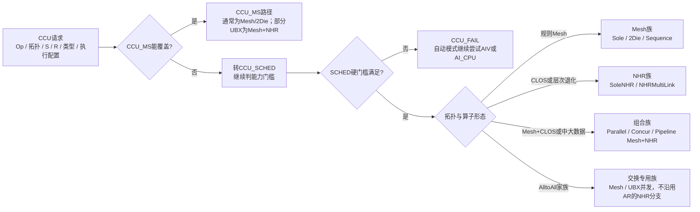

# HCCL CCU算子选择：一页PPT版

> 说明：用户口中的“CCO”在当前HCCL源码中对应的是`CCU`执行引擎，具体分为`CCU_MS`和`CCU_SCHED`。本文按仓库提交`7696133a4500`整理，重点覆盖AllReduce、ReduceScatter、AllGather和AlltoAll家族的常见路径。

## PPT标题

**CCU先做能力门控，再按拓扑形态和数据规模选择Mesh、NHR或组合执行路径**

## 1. 先区分三层概念

| 层次 | 在CCU选择中的含义 | 典型例子 |
| --- | --- | --- |
| 算法族 | 描述通信阶段如何组织，决定数据经过哪些通信关系 | Mesh、NHR、Mesh+NHR、AlltoAll Mesh |
| Executor | 把算法族封装成可调度的执行器，负责切分、同步、资源和多链路调度 | `CcuMsAllReduce...`、`CcuSchedAllReduce...` |
| Template | Executor调用的更细粒度设备/通信模板，负责具体搬运和同步细节 | Sole、2Die、Sequence、Parallel、Concur、Pipeline、UBX |

因此，图中“Mesh类”不是一个单独函数，而是**Executor+Template的候选族**。例如`ParallelMeshNHR`表示先利用Mesh层，再通过NHR层并行推进；`PipelineMeshNHR`表示在此基础上切块重叠。

## 2. 固定选择路线图

## 3. 每个分支到底看什么

| 顺序 | 判别问题 | 典型前置条件 | 常见结果 |
| --- | --- | --- | --- |
| ① | `CCU_MS`能不能接 | 主要面向AR/RS/AG；通常要求较简单的层次、非strict、支持的数据类型和归约类型 | `CCU_MS`的Mesh、2Die或少量组合模板 |
| ② | `CCU_SCHED`能不能接 | 通常要求无`level2UbRtp`、拓扑层数不超过2层；strict、部分64位/PROD、部分inplace场景会拒绝 | 不满足则返回`CCU_FAIL` |
| ③ | Level0形态是什么 | 全Mesh、CLOS、Mesh+CLOS、UBX、混合PCIe | 缩小到Mesh、NHR或混合候选集 |
| ④ | 层次是否有效 | `Level1Nhr`、本地组为1、2Die是否完整、层间是否全连 | 层次退化时倾向`SoleNHR`；有效层次才保留Mesh+NHR组合 |
| ⑤ | 数据量和rank处于哪个档位 | 不同算子使用不同阈值；还会看帧数、CCL Buffer和链路并发能力 | 小数据偏Sole/低启动开销，中大数据偏Parallel/Concur/Pipeline |
| ⑥ | 是否属于AlltoAll | AlltoAll、AlltoAllV、AlltoAllVC有单独Selector，不直接复用AR/RS/AG规则 | 多为Mesh或UBX内部并发；不满足则回退 |

## 4. 算法族的粗粒度触发规则

| 算法族 | 什么时候容易触发 | 不适合/会被替换的情况 |
| --- | --- | --- |
| **Mesh** | 本层全连接、rank较小、数据量小到中等；2Die完整时使用2Die变体 | 连接不全、CLOS主导或层次明显退化 |
| **SoleNHR** | CLOS、`Level1Nhr`、本地组为1，或者无法形成有效层次并行 | 拓扑规则且全Mesh时通常不优先 |
| **Parallel/Concur Mesh+NHR** | Mesh+CLOS或两层有效、数据量中等，需要同时利用本地和跨组链路 | 帧数过多、链路不对称、能力不满足时降为SoleNHR或回退 |
| **Pipeline Mesh+NHR** | PCIe混合、连接不全、数据较大且可切块流水 | 数据太小、无法切块或资源不满足 |
| **Sequence Mesh+NHR** | 超大数据或需要分阶段推进，尤其是多层规则Mesh | 小数据追求低启动时延时通常不用 |
| **AlltoAll Mesh/UBX** | AlltoAll家族、对端关系规则、UBX组内满足并发条件 | `CCU_MS`当前不覆盖；SCHED对层次、rank和组形态限制更严格 |

## 5. 代表性阈值（只作定位，不是全局常数）

源码按算子分别定义阈值，不能把一个算子的阈值直接套给另一个算子。以下是用于汇报时的“量级判断”：

| 算子/路径 | 代表性门槛 | 选择倾向 |
| --- | --- | --- |
| AllReduce / CCU_MS | 两层、2P等特殊场景在约`8MB`量级可能退出MS | 转SCHED或AI_CPU |
| AllReduce / CCU_SCHED | 有效两层、总数据不大于约`64MB`时仍可能使用Mesh+NHR组合；更大可能回退 | Parallel/Concur；超限回退 |
| ReduceScatter / AllGather | 2P约`4MB`量级会触发更保守的路径；大数据和非全连场景更易走NHR组合 | Mesh、SoleNHR或Pipeline |
| CLOS/退化层次 | 小数据优先降低启动成本；中大数据才保留多链路并发 | SoleNHR → Parallel/Concur/Pipeline |
| AlltoAll | SCHED常见rank上限约`64`；更细的V/VC路径还有各自限制 | Mesh/UBX；不满足则回退 |

## 6. 给领导汇报时的一句话

> **CCU不是先在Ring、NHR、Mesh之间盲选，而是先判断当前硬件能力和拓扑是否能由CCU承接；承接后先看全Mesh还是CLOS/混合，再按有效层次和数据规模选择单路、并行、并发或流水模板，任何门槛不满足就沿统一回退链路交给下一个执行引擎。**

## 7. 讲解备注

1. `CCU_MS`是较窄的快速承接路径，`CCU_SCHED`是更完整的调度路径；两者都属于执行引擎层，不等同于Mesh或NHR算法名。
2. Mesh/NHR是算法族，Sole/Parallel/Concur/Pipeline/Sequence更接近Executor或Template的编排形式。
3. “大数据走NHR”不是绝对规则：如果拓扑是全Mesh，仍可能走Mesh；只有在层次、连通性和资源条件共同满足时，才会出现Mesh+NHR组合。
4. AlltoAll是例外最大的家族，当前代码对CCU_MS覆盖有限，SCHED和AIV也有独立的rank、层次与Buffer门槛。

## 源码定位

- [AutoSelector统一回退链路](https://gitcode.com/cann/hccl/blob/7696133a450094fe26dd1eaed7b075258b452a9f/src/ops/op_common/selector/auto_selector_base.cc)
- [CCU/AIV公共阈值与上限](https://gitcode.com/cann/hccl/blob/7696133a450094fe26dd1eaed7b075258b452a9f/src/ops/op_common/selector/auto_selector_base.h)
- [AllReduce CCU选择](https://gitcode.com/cann/hccl/blob/7696133a450094fe26dd1eaed7b075258b452a9f/src/ops/all_reduce/selector/all_reduce_auto_selector.cc)
- [ReduceScatter CCU选择](https://gitcode.com/cann/hccl/blob/7696133a450094fe26dd1eaed7b075258b452a9f/src/ops/reduce_scatter/selector/reduce_scatter_auto_selector.cc)
- [AllGather CCU选择](https://gitcode.com/cann/hccl/blob/7696133a450094fe26dd1eaed7b075258b452a9f/src/ops/all_gather/selector/all_gather_auto_selector.cc)
- [AlltoAll CCU/AICPU/AIV选择](https://gitcode.com/cann/hccl/blob/7696133a450094fe26dd1eaed7b075258b452a9f/src/ops/all_to_all_v/selector/alltoall_auto_selector.cc)

配套交互图：[CCU单页路线图（HTML）](../../diagrams/hccl-ccu-selector-one-slide.html)，规格文件：[Archify JSON](../../diagrams/hccl-ccu-selector-one-slide.archify.json)。
